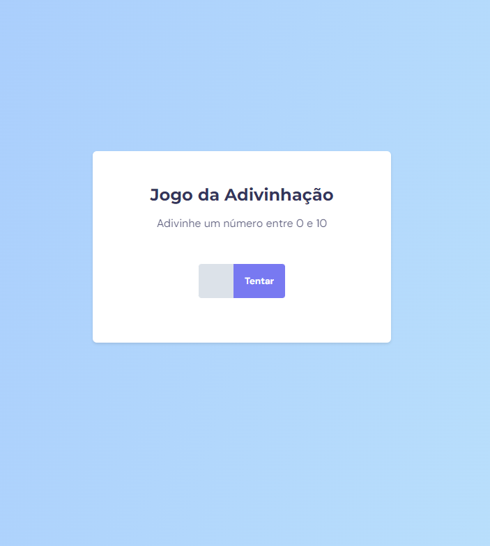

<h1 align="center"> Projeto Jogo da Advinhação </h1>

Projeto do curso Explorer da RocketSeat.

  <a href="#-tecnologias">Tecnologias</a>&nbsp;&nbsp;&nbsp;|&nbsp;&nbsp;&nbsp;
  <a href="#-projeto">Projeto</a>&nbsp;&nbsp;&nbsp;|&nbsp;&nbsp;&nbsp;
  <a href="#-licença">Licença</a>

  

 

  

## 🚀 Tecnologias

Esse projeto foi desenvolvido com as seguintes tecnologias:

- HTML e CSS
- JavaScript
- Git e Github

## 💻 Projeto

O projeto Jogo da Advinhação é um projeto criado por mim para treinar as tecnologias aprendidas em curso como Js, HTML e CSS, esse projeto é um projeto em que você informa um número e esse número vai se verificado para ver se é o mesmo que o número gerado, quando você acertar vai ser informado em quantas tentativas isso foi feito. Acesse o projeto [AQUI](https://yuriverwiebe.github.io/projeto-advinhacao)

## 📝 Licença

Esse projeto está sob a licença MIT.

---

Feito com ♥ by Yuri Verwiebe 🌊
